<p align="center">
  
</p>

<h1 align="center">BeaverMeter</h1>

<p align="center">Usage monitoring for Codex, Claude Code, Cursor, and DeepSeek — in your macOS menu bar and on your desktop.</p>

<p align="center">
  <a href="https://www.apple.com/macos/"></a>
  <a href="https://www.swift.org/"></a>
  <a href="https://github.com/fusheng-ji/token_quota_widget/releases/tag/v5.4.0"></a>
  <a href="LICENSE"></a>
</p>

<p align="center">
  <a href="https://openai.com/codex/"></a>
  <a href="https://www.claude.com/product/claude-code"></a>
  <a href="https://cursor.com/"></a>
  <a href="https://platform.deepseek.com/"></a>
</p>

<p align="center">
  <a href="#-features">Features</a> ·
  <a href="#-quick-start">Quick start</a> ·
  <a href="#-interface">Interface</a> ·
  <a href="#-data-sources">Data sources</a> ·
  <a href="#-privacy">Privacy</a> ·
  <a href="#-troubleshooting">Troubleshooting</a> ·
  <a href="#-development">Development</a>
</p>

BeaverMeter is a native macOS menu-bar app and WidgetKit extension that keeps
Codex and Claude Code token activity and quota, Cursor model-call costs and
Monthly allowance, and DeepSeek monthly usage and wallet balance in one place.
See [CHANGELOG.md](CHANGELOG.md) for the problem addressed by every verifiable
release.

## ✨ Features

- **Codex & Claude Code** — today's tokens from local session logs plus quota
  windows with reset countdowns; Claude shows five-hour, weekly and
  model-scoped (Fable) limits side by side.
- **Codex workspaces** — monitor separate plans and limits for workspaces
  belonging to the same account; add sign-ins directly in BeaverMeter.
- **Reset cards & history** — Codex Banked resets and Claude Limit resets
  with expiration details, plus compact rolling seven-day token charts.
- **Cursor** — actual per-call charges (not list prices) and Monthly allowance.
- **DeepSeek** — wallet balance and current-month cost, tokens and requests.
- **Adaptive** — the menu bar, popover and every Widget size show only the
  services you use; enable or disable each one from Services.
- **Local-first** — credentials come from your existing sessions and never
  enter the snapshot; hidden services are never contacted.
- **Resilient** — every source refreshes independently and falls back to its
  last good value, clearly marked stale.

## 🚀 Quick start

**Requirements:** macOS 14+, full Xcode at `/Applications/Xcode.app`,
[XcodeGen](https://github.com/yonaskolb/XcodeGen), and at least one of: Codex
desktop app or CLI used locally, Claude Code used locally (signed in for the
quota), Cursor signed in locally, or a DeepSeek Platform account.

```bash
brew install xcodegen
chmod +x scripts/*.sh Tests/*.sh
./scripts/install.sh
```

The installer builds `~/Applications/BeaverMeter.app`, installs the
`io.github.beavermeter.refresh` LaunchAgent, registers the Widget and starts the
menu-bar app. Run the same command to upgrade.

<details>
<summary><b>Installer details and remote Codex (SSH)</b></summary>

The installer asks for an optional Apple Developer Team ID, a unique bundle
prefix, local data paths, an optional remote source and a refresh interval.

SSH is disabled by default on a fresh install. When enabling it, specify the
SSH host alias, absolute remote Codex directory and absolute Python executable
path. Upgrades retain the existing values, including a disabled source. These
settings are stored in the private `config.env` as `CODEX_REMOTE_SSH_HOST`,
`CODEX_REMOTE_ROOT` and `CODEX_REMOTE_PYTHON`.

Claude needs no installer questions. To use a non-default Claude Code
directory, add `CLAUDE_CONFIG_DIR=/path` to `config.env`; upgrades keep it and
`CLAUDE_KEYCHAIN_ACCESS`.

Building completes before the installer stops the running app or agent. During
replacement it keeps a rollback copy of the app, agent and data; validation
failure restores them before restarting the old installation. Widget repair
uses the same registration and process helpers.

</details>

<details>
<summary><b>Upgrading from 4.4.0 (CodexWeek)</b></summary>

The 5.0.0 installer migrates `config.env`, the DeepSeek token and a valid schema
v5 snapshot from `~/Library/Application Support/CodexWeek/` into the new
BeaverMeter data directory. Existing destination files always win. It keeps a
rollback copy while validating the replacement; after a successful install it
removes the old app, LaunchAgent, data and logs. If validation fails, the old
installation is restored and the legacy data remains available.

The App and Widget now have new bundle IDs and the Widget kind changed. macOS
cannot convert an existing desktop Widget automatically: remove the old Widget,
then add **BeaverMeter** from **Edit Widgets**.

The new build settings and script overrides are `BEAVERMETER_*` and
`BEAVER_METER_CONFIG`. Version 5.0.0 also accepts the legacy `CODEXWEEK_*` and
`CODEX_WEEK_CONFIG` names as lower-priority aliases.

</details>

## 🖼 Interface

The menu bar shows Codex tokens, Claude tokens (`✳︎`), Cursor's latest actual
charge and DeepSeek's wallet balance in one compact line. The popover expands
this into Codex input, cached input, output and reasoning totals; Claude input,
cache write, cache read and output totals with an API-rate cost estimate, plus
its five-hour, weekly and model-scoped (for example Fable) limits;
Cursor's daily actual charge and the latest 20 model calls; and DeepSeek
balance, current-month cost, tokens and requests.

<p align="center">
  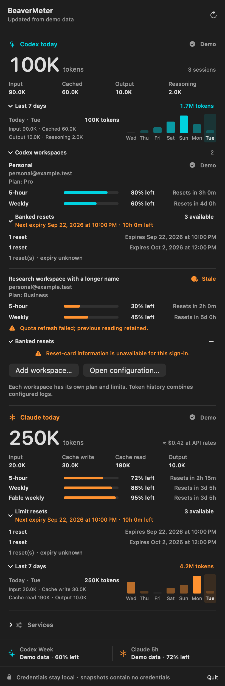
</p>

Expand **Codex workspaces** to see each workspace's plan, limits and reset
cards. **Last 7 days** shows compact daily bars and selectable token details;
Codex totals combine the configured logs rather than allocating tokens to plans.

<details>
<summary><b>Compact Services controls</b></summary>

<p align="center">
  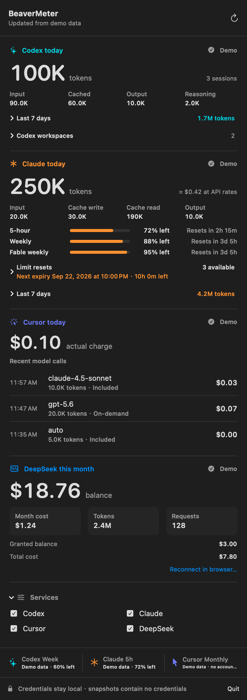
</p>

</details>

**Services.** Every layout adapts to the services you actually use. Each
service uses automatic detection by default and appears once it has produced data on
this Mac, so a missing Cursor install or an unconnected DeepSeek account leaves
no empty panel. Open **Services** at the bottom of the popover and use the
checkboxes to enable a service (for example to connect DeepSeek) or disable it. Services switched
off are not contacted at all. The switches are stored in
`~/Library/Application Support/BeaverMeter/beaver-meter-settings.json`, which
the Widget and collector read too.

| Family | Layout |
| --- | --- |
| Small | One row per service; with one or two services, larger panels |
| Medium | Services in pairs; an odd service out spans the bottom row |
| Large | Pairs with reset times, progress and DeepSeek details; one or two services stack full width |
| Extra Large | Large layout with wider panels |

<details>
<summary><b>All Widget sizes × number of services</b></summary>

<table>
  <tr>
    <th></th>
    <th>4 services</th>
    <th>3 services</th>
    <th>2 services</th>
    <th>1 service</th>
  </tr>
  <tr>
    <th>Small</th>
    <td align="center">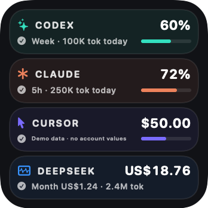</td>
    <td align="center">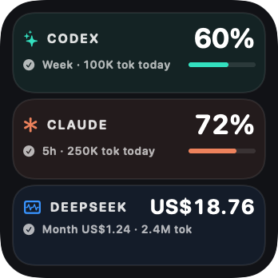</td>
    <td align="center">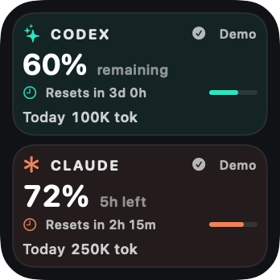</td>
    <td align="center">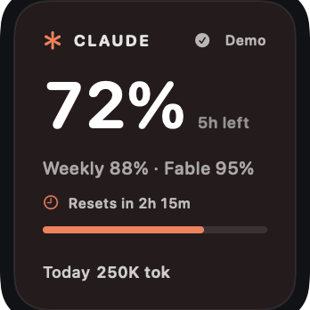</td>
  </tr>
  <tr>
    <th>Medium</th>
    <td align="center">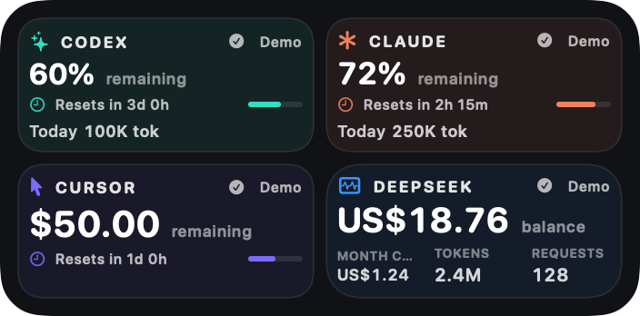</td>
    <td align="center">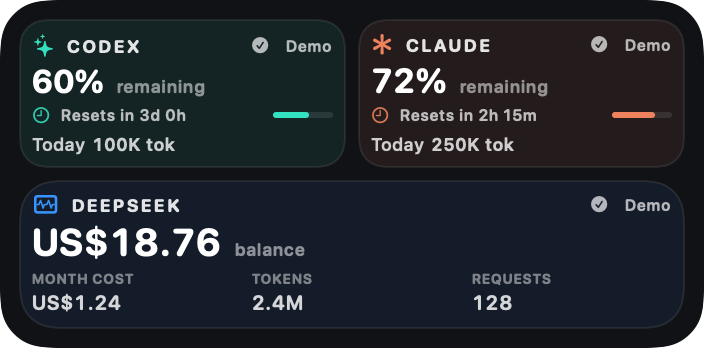</td>
    <td align="center">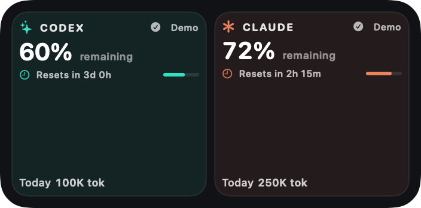</td>
    <td align="center">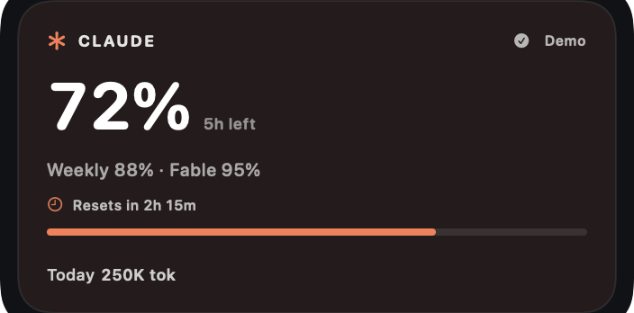</td>
  </tr>
  <tr>
    <th>Large</th>
    <td align="center">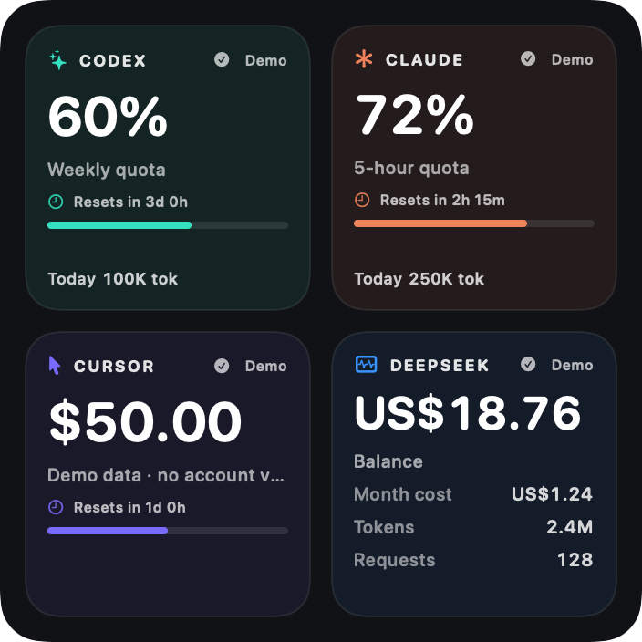</td>
    <td align="center">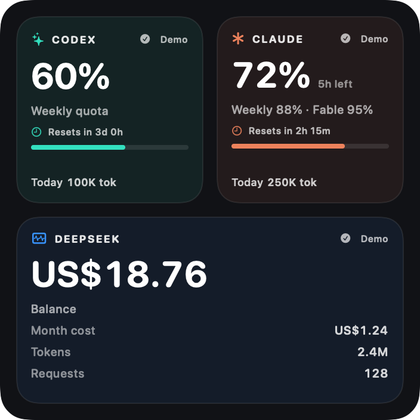</td>
    <td align="center">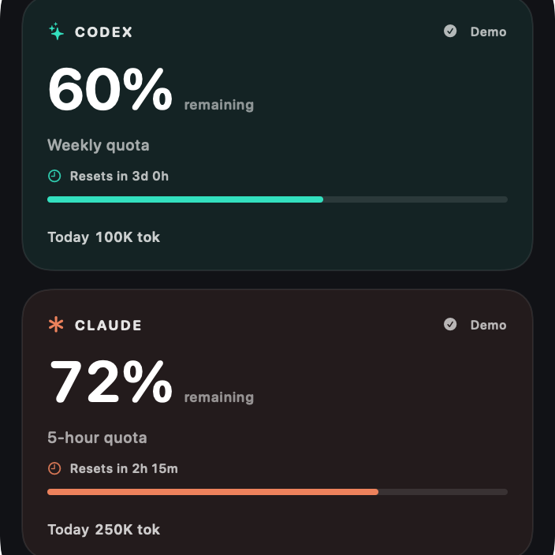</td>
    <td align="center">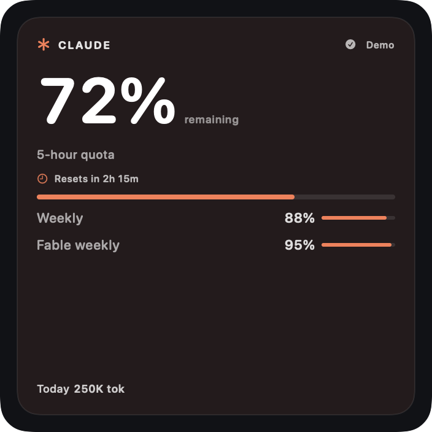</td>
  </tr>
  <tr>
    <th>Extra Large</th>
    <td align="center">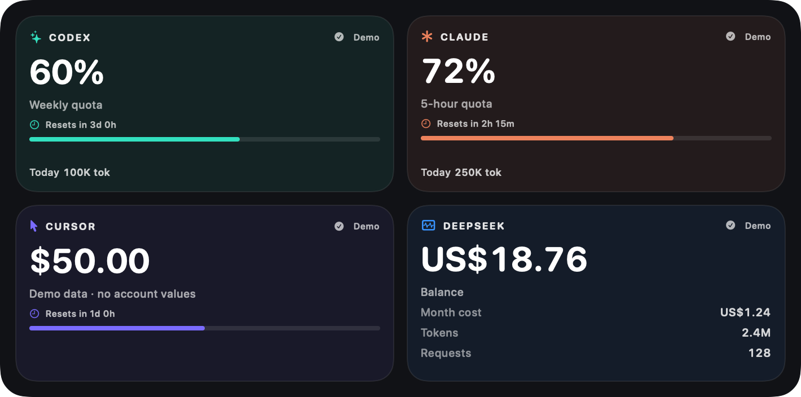</td>
    <td align="center">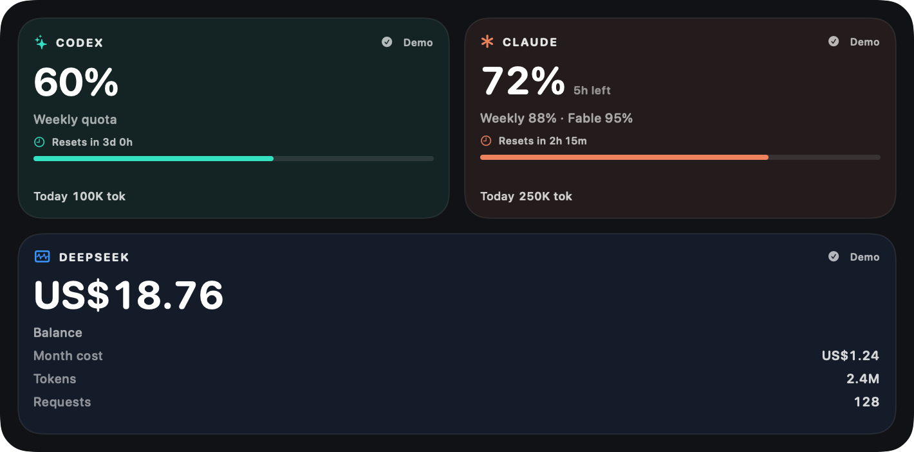</td>
    <td align="center">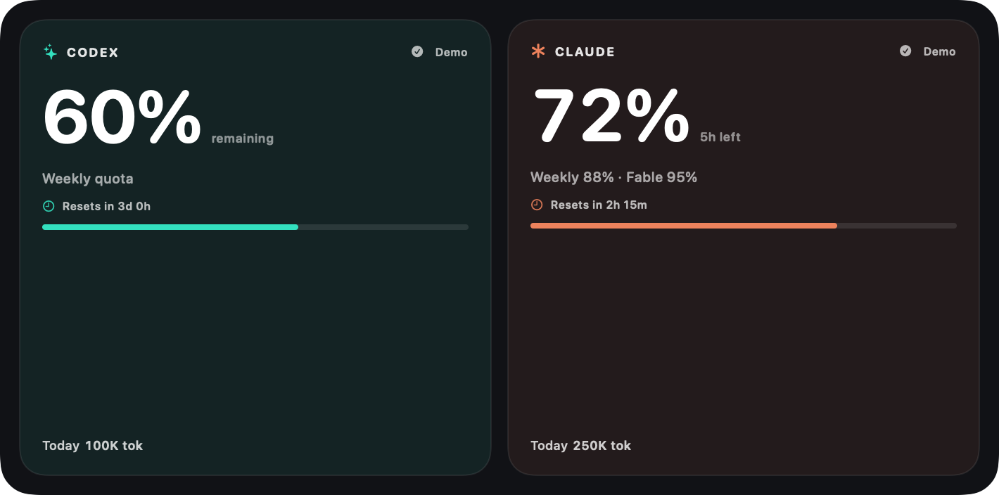</td>
    <td align="center">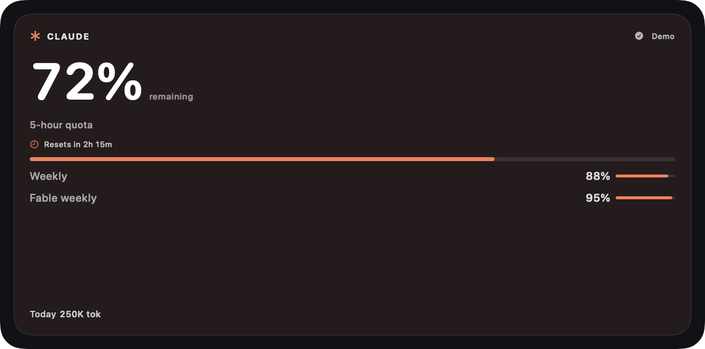</td>
  </tr>
</table>

Columns use Codex + Claude + Cursor + DeepSeek, then without Cursor, then
Codex + Claude, then Claude alone. A service with a tile or full row to itself
gets a larger panel.

Every screenshot is generated from the bundled preview snapshot; none contains
live account values or private Cursor activity.
The [remote-unavailable example](screenshots/widget-small-remote-unavailable.png)
shows how today's cached tokens remain visible with an amber `Remote` warning.

</details>

<details>
<summary><b>What the panels and colours mean</b></summary>

Codex's and Claude's allowances stay the primary values; their **Today** lines
show the same daily token totals as the menu. Token freshness is independent
of quota freshness, so a failed remote scan is visible even when the quota API
is healthy. Unknown values show `—`, while a successful empty day shows `0`.

Codex, Claude and Cursor show remaining allowance, reset countdown and a
progress line. Codex is teal, Claude is orange and Cursor is indigo; values
below 50% turn amber and values below 20% turn red. DeepSeek uses blue and
reports its real wallet balance and monthly activity. Because DeepSeek does not
publish a quota limit or reset time, BeaverMeter does not invent a percentage
or progress bar.

</details>

## 📊 Data sources

<details>
<summary><b>Codex workspaces, banked resets and seven-day tokens</b></summary>

Expand **Codex workspaces** and choose **Add workspace…**. Name the workspace
and complete Codex sign-in in your browser. BeaverMeter stores each login
separately under its own `codex-workspaces/<UUID>` directory in Application
Support. Choose **Sign in…** on a workspace row to reconnect it. Codex CLI
must be available; CodexBar does not need to be installed or running.

To reuse an existing Codex directory, choose **Open configuration…** and add profile homes to
`~/Library/Application Support/BeaverMeter/beaver-meter-accounts.json`:

```json
{
  "version": 1,
  "providers": [{
    "id": "codex",
    "codexProfileHomePaths": ["~/.codex-work", "~/.codex-personal"]
  }]
}
```

This uses CodexBarCore's configuration and credential readers. The current
`CODEX_HOME` (or the default `~/.codex`) is always included; duplicate and
symlink-equivalent directories are read once. Each added home must already
have its own Codex sign-in. Save the file and refresh BeaverMeter to see its
quota windows and banked reset cards. Configuration errors and unavailable
profiles are shown in the menu. BeaverMeter does not switch logins or redeem
cards, and caches for a previous account are not reused after a profile's
account or workspace changes.

Workspaces belonging to the same email remain separate: each row shows its
own plan, quota windows and banked resets. BeaverMeter reads its own workspace
registry and explicitly configured profile homes. It does not automatically
read CodexBar's managed logins. The original widget and menu-bar summary
continue to use the current Codex home.

For an explicit workspace selection, add a top-level `codexWorkspaces` array
beside `version` and `providers`:

```json
"codexWorkspaces": [
  {"home": "~/.codex-work", "workspaceAccountID": "<ChatGPT workspace UUID>", "workspaceLabel": "Research"}
]
```

Use the ChatGPT workspace ID, not an API organization ID (`org-…`). A
selection differing from the credential's default workspace is accepted only
when the usage response confirms the selected workspace ID. Otherwise the
row asks for a separate profile signed in to that workspace. Expired logins
remain separate error rows; they never borrow another workspace's usage.
External authentication files are never rewritten to select a workspace. Local token
history still combines logs and cannot attribute tokens to individual plans.

Codex cards come from CodexBarCore's read-only
`/wham/rate-limit-reset-credits` request. Claude cards use the existing Claude
Code sign-in and `/api/oauth/usage?cedar_ember=1&skip_spend=1`, the read path
in Claude Code 2.1.284. These provider interfaces may change. Missing fields
or an unsupported request surface mean unavailable, not zero. The request
uses the installed CLI version and its `claude-cli/<version> (external, cli)`
User-Agent format; failed requests can retain a clearly marked
last reading. Expand **Banked resets** (Codex) or **Limit resets** (Claude) to see exact local expiration times,
unknown expirations and any usage restrictions. Reading cards uses the existing
service sign-in and never redeems a reset.

**Last 7 days** covers today and the previous six calendar days in the Mac's
time zone. Compact daily bars roll from oldest to newest without aligning
to a calendar week, with English weekday labels instead of dates. Bar heights
show each day's tokens relative to the service's seven-day maximum. Hover or
click a bar to update the adjacent count and token categories; the last selected
day stays visible. The summary tooltip describes the configured log sources.
Codex combines the configured local logs and optional SSH source;
Claude reads local transcripts. This is recorded token activity, not a
conversion of subscription quota percentages or a complete cloud-account
usage report. Cached input and reasoning are subsets of Codex input/output;
Claude adds cache write and cache read to input/output. Responses are
deduplicated across modern Codex logs and SSH. Overlapping legacy sessions
whose per-response history cannot be recovered are excluded and marked
incomplete. Foldout states are remembered between popover visits.
The interface uses English labels and date formats while keeping the Mac's
local time zone for collection and expiration times.

The collector writes schema v7 snapshots and accepts v5/v6 snapshots during
upgrade. All monitoring values remain credential-free.

</details>

Each service is read from the same official data its own app or dashboard
uses. Expand a service for exact paths, endpoints and counting rules.

<details>
<summary><b>Codex tokens</b> — local <code>~/.codex/sessions</code> logs, optional remote host over SSH</summary>

The bundled collector uses
[CodexBarCore](https://github.com/steipete/CodexBar/) pinned to the 0.56.5 release
commit [`07f2a670229bca1a34bb7eda5284c89657b8df9a`](https://github.com/steipete/CodexBar/commit/07f2a670229bca1a34bb7eda5284c89657b8df9a).
Its local scanner aggregates the current local day across `~/.codex/sessions`,
including compressed sessions, duplicate events, file boundaries and newly
appended events in a still-running Codex task.

An optional SSH source can add Codex tasks running on another machine. The
installer configures the SSH host, remote Codex directory and Python path. The
bundled read-only scanner returns only hashed response/session identifiers,
timestamps and token counts; prompts, responses and credentials never leave
the remote host. Local and remote responses are deduplicated before display.
When SSH is temporarily unavailable, BeaverMeter retains the last remote
reading from the current local day and marks the total stale.
The scanner also checks the current user's running Codex app-server for its
active `CODEX_HOME`. If Codex moves its data, BeaverMeter reads both the
configured directory and the active directory, deduplicates responses and
retains today's discovered records after the process exits. Multiple different
active homes are reported as incomplete rather than silently choosing one.

Both refresh modes resolve the local legacy-format fallback before adding
remote responses that do not occur in the local record set. Active and archived
rollouts are searched regardless of their original date directory. Read failures
remain distinct from a valid empty result, and changing a source configuration
invalidates that source's old totals.

The displayed total is `input + output`. Cached input is part of input and
reasoning is part of output, so neither detail is counted twice.

</details>

<details>
<summary><b>Codex quota</b> — <code>chatgpt.com</code> with your existing Codex sign-in</summary>

The quota panel reuses the existing Codex sign-in from `~/.codex/auth.json` and
requests:

```text
https://chatgpt.com/backend-api/wham/usage
```

Windows are identified by `limit_window_seconds`; the window with the least
remaining allowance becomes the Widget summary. Credits-only responses show a
balance, unlimited or exhausted state without inventing a percentage.

</details>

<details>
<summary><b>Claude tokens</b> — local Claude Code transcripts</summary>

The same CodexBarCore scanner reads Claude Code transcripts from
`$CLAUDE_CONFIG_DIR/projects` when that variable is set, otherwise from
`~/.config/claude/projects`, `~/.claude/projects` and Claude Desktop's local
Claude Code stores. Streamed chunks of one message are counted once by
message and request ID, and the day follows the local time zone. BeaverMeter
keeps its own scan index in
`~/Library/Application Support/BeaverMeter/claude-cost-usage/`.

Claude's `input_tokens` excludes cache traffic, so the displayed total is
`input + cache write + cache read + output`. The cost is an estimate at API
list prices from CodexBarCore's bundled price table; it is hidden for models
the table does not know yet and is not what a Pro or Max subscription is
billed. A machine without Claude transcripts shows no data rather than `0`.

</details>

<details>
<summary><b>Claude quota</b> — <code>api.anthropic.com</code> with Claude Code's own sign-in</summary>

The Claude quota reuses Claude Code's own sign-in and requests the windows
shown by Claude Code's `/usage`:

```text
https://api.anthropic.com/api/oauth/usage
```

It reads the five-hour and all-models weekly windows plus every model-scoped
weekly limit, such as Fable (from the response's `limits` list) or the older
Opus and Sonnet fields. The popover lists each window with its reset time. The
Widget shows the five-hour window as its headline number and the others on
one line, for example `Weekly 88% · Fable 95%` (`Wk` where space is short).
Without a five-hour window, the tightest window becomes the headline. The access token is read from `~/.claude/.credentials.json` (or
`$CLAUDE_CONFIG_DIR/.credentials.json`), otherwise from the login Keychain
item `Claude Code-credentials` through `/usr/bin/security`, which is how
Claude Code writes it.

Claude Code's access token lasts only a few hours and is renewed by the CLI
itself. BeaverMeter never refreshes the token, because that would rotate the
refresh token Claude Code depends on. When the token has expired, it briefly
starts the installed `claude` CLI in a hidden terminal (at most once every five
minutes), waits until Claude Code has renewed its sign-in, then stops it: no
prompt is sent, the folder-trust question is never answered and the model is
never called. The CLI is looked up in `~/.local/bin`, `~/.claude/local`,
`/opt/homebrew/bin` and `/usr/local/bin`, or set `CLAUDE_CLI_PATH` in
`config.env`. Set `CLAUDE_CLI_REFRESH=0` to turn this off, or
`CLAUDE_KEYCHAIN_ACCESS=0` to skip the Keychain entirely.

</details>

<details>
<summary><b>Cursor call costs and Monthly usage</b> — official Cursor Dashboard data</summary>

The collector reads Cursor's existing local sign-in token from `state.vscdb`,
keeps it in process memory and requests the same official Dashboard data used
by [cursor.com/dashboard/usage](https://cursor.com/dashboard/usage):

```text
https://cursor.com/api/dashboard/get-filtered-usage-events
https://cursor.com/api/usage-summary
```

Each call uses `chargedCents`, the amount actually deducted by Cursor, rather
than the model provider list price. `$0.00` calls remain visible. If a valid
call has no valid actual charge, its charge is shown as unknown and the daily
total is withheld instead of understated.

Monthly usage prefers `individualUsage.plan`, then `individualUsage.overall`
when Cursor exposes an individual Enterprise allowance. Team pools and
administrator Team Caps are never presented as personal Monthly usage.

</details>

<details>
<summary><b>DeepSeek usage and balance</b> — official DeepSeek Platform data via your browser session</summary>

Choose **Connect in browser…** in the menu. BeaverMeter opens the official
DeepSeek Platform page and continues checking in the background, so closing the
popover does not interrupt sign-in.

For Chromium browsers (Chrome, Edge, Arc, Brave and compatible variants), the
collector reads only the `userToken` entry belonging to
`https://platform.deepseek.com`. With Safari, BeaverMeter requests macOS
Automation access to the official DeepSeek tab and reads the same key through
Safari's Apple Events interface. In Safari, first enable **Settings → Advanced
→ Show features for web developers**, then **Settings → Developer → Allow
JavaScript from Apple Events**.

The token is validated against DeepSeek and stored at
`~/Library/Application Support/BeaverMeter/deepseek-platform-token` with mode
`600`. The collector requests the same official data used by
[platform.deepseek.com/usage](https://platform.deepseek.com/usage):

```text
https://platform.deepseek.com/api/v0/users/get_user_summary
https://platform.deepseek.com/api/v0/usage/amount?month=<month>&year=<year>
https://platform.deepseek.com/api/v0/usage/cost?month=<month>&year=<year>
```

The range starts on the first day of the current local month. Token totals add
cache-hit input, cache-miss input and output exactly once. Costs and balances
retain DeepSeek's returned currency. DeepSeek failures do not interrupt Codex
or Cursor refreshes, and the last successful DeepSeek value remains visible as
stale.

</details>

<details>
<summary><b>Refresh schedule and fallback</b></summary>

BeaverMeter refreshes on launch, whenever the popover opens, on manual refresh
and every five minutes through its LaunchAgent. The Widget requests a matching
five-minute timeline, subject to WidgetKit scheduling.

While the app is running, Codex and Claude activity refresh every 45 seconds
through the same collector service used by full refreshes. These activity polls
do not call the other providers or the quota APIs. Overlapping app requests are
coalesced; collectors serialize snapshot writes, and the app reloads Widget
timelines only when it adopts a newer snapshot.

Codex tokens, Claude tokens, Cursor costs, Cursor quota, Codex quota, Claude
quota and DeepSeek usage refresh independently. If one source fails, its latest
successful value stays visible as stale while the others continue updating.
Cache older than three hours gets a strong warning; missing live data is never
replaced with preview data.

The snapshot is schema v6, which adds the Claude values. A schema v5 snapshot
is read with Claude marked unavailable, so upgrades keep the other providers'
stale fallback. Snapshots from schema v2-v4 are rejected and regenerated by the
next refresh.

</details>

## 🔒 Privacy

- Cursor, Codex and Claude Code credentials come from existing local sessions
  and remain in collector memory. The validated DeepSeek browser token is
  stored locally with mode `600` for background refresh.
- The snapshot contains no authentication tokens, cookies,
  user/team/conversation IDs, prompts or response content.
- HTTP requests go only to `cursor.com`, `chatgpt.com`, `api.anthropic.com`
  and `platform.deepseek.com`.

<details>
<summary><b>More privacy and storage details</b></summary>

- Requests require successful responses, validate response shape and use
  finite timeouts. Optional SSH traffic goes only to the configured host, with
  non-interactive authentication, an eight-second connection timeout and a
  30-second total timeout.
- The snapshot is atomically replaced at
  `~/Library/Application Support/BeaverMeter/beaver-meter-snapshot.json`.
- The data directory is mode `700`; credentials and snapshots are mode `600`.
- Repository screenshots use deterministic `UsageSnapshot.preview` data only.

</details>

## 🩺 Troubleshooting

<details>
<summary><b>Cursor says Sign in</b></summary>

Open Cursor, confirm the intended account is active, then refresh.

</details>

<details>
<summary><b>Codex has no token data</b></summary>

Run at least one local Codex session and refresh.

</details>

<details>
<summary><b>Claude has no token data</b></summary>

Run Claude Code once, or set `CLAUDE_CONFIG_DIR` in `config.env` if it uses a
non-default directory.

</details>

<details>
<summary><b>Claude quota says Sign in</b></summary>

Claude Code's saved sign-in has expired and could not be renewed
automatically. Make sure the `claude` CLI is installed (BeaverMeter uses it to
renew the sign-in; see [Claude quota](#-data-sources)), then run `claude` and
`/login` once and refresh BeaverMeter.

</details>

<details>
<summary><b>Remote Codex is missing</b></summary>

Verify that the configured SSH alias works in a non-interactive terminal and
that the remote Codex and Python paths still exist. If Codex has moved its
home, update `CODEX_REMOTE_ROOT` to the new path; active app-server discovery
keeps today's records visible during the move.

</details>

<details>
<summary><b>DeepSeek says Connect</b></summary>

Choose **Connect in browser…** and finish signing in on the official page.
Safari may request Automation permission; enable both developer settings
described under [Data sources](#-data-sources), then use **Check now**.

</details>

<details>
<summary><b>Data is stale</b></summary>

Inspect `~/Library/Logs/BeaverMeter/` and verify access to `cursor.com`,
`chatgpt.com`, `api.anthropic.com` and `platform.deepseek.com`.

</details>

<details>
<summary><b>Widget is blank, stale, missing or duplicated</b></summary>

Run `./scripts/repair_widget.sh`. The script removes conflicting registrations,
restarts the WidgetKit caches and relaunches BeaverMeter. Add the Widget again
from **Edit Widgets** only when upgrading from 4.4.0.

</details>

## 🛠 Development

Run the complete local test suite:

```bash
./scripts/test.sh
```

<details>
<summary><b>Individual test commands</b></summary>

Generate the project and run Swift tests:

```bash
xcodegen generate
xcodebuild \
  -project BeaverMeter.xcodeproj \
  -scheme BeaverMeter \
  -derivedDataPath /tmp/beavermeter-derived \
  test
```

Run the network-free integration and migration tests:

```bash
./Tests/collector_test.sh \
  /tmp/beavermeter-derived/Build/Products/Debug/BeaverMeterCollector
./Tests/migration_test.sh
```

For an interactive window with a collected snapshot, build the
`BeaverMeterPreviewRenderer` scheme, then run:

```bash
/tmp/beavermeter-preview-derived/Build/Products/Debug/BeaverMeterPreviewRenderer \
  --interactive "/path/to/beaver-meter-snapshot.json"
```

Use the binary in your chosen DerivedData directory. This window displays a
snapshot, supports foldouts and scrolling, and leaves the installed app
running. Automatic polling is disabled; explicit workspace sign-in and Refresh
actions can collect usage into the supplied snapshot directory. Workspace sign-in
requires the collector helper in a preview app bundle.

</details>

<details>
<summary><b>Fixtures and test coverage</b></summary>

Collector fixture overrides:

```text
CODEX_TOKEN_FIXTURE
CODEX_USAGE_FIXTURE
CLAUDE_TOKEN_FIXTURE
CLAUDE_USAGE_FIXTURE
CODEX_HISTORY_FIXTURE
CLAUDE_HISTORY_FIXTURE
CODEX_RESET_CARDS_FIXTURE
CLAUDE_RESET_CARDS_FIXTURE
CURSOR_EVENTS_FIXTURE
CURSOR_SUMMARY_FIXTURE
DEEPSEEK_USAGE_FIXTURE
DEEPSEEK_SUMMARY_FIXTURE
CURSOR_STATE_DB
CODEX_TOKEN_CACHE_ROOT
CLAUDE_TOKEN_CACHE_ROOT
CLAUDE_CONFIG_DIR
CODEX_REMOTE_RESPONSE_FIXTURE
```

Coverage includes schema v7 round trips and v5/v6 upgrades, account and workspace
cache isolation, reset-card expiration and unknown fields, seven-day boundaries
and daylight saving time, status presentation,
service switches and adaptive layout rows, refresh request coalescing, private
atomic writes, subprocess timeout and large stdio, mixed Codex formats and
cross-host deduplication, rollover and partial records, unreadable sources,
remote failure/recovery, Codex and Claude quota-window selection, Claude
transcript deduplication, tolerant Cursor number decoding, actual-charge
totals, independent stale fallback, migration/configuration preservation and
installer rollback. Tests use isolated fixtures and fake SSH/system commands
rather than real account sessions.

</details>

<details>
<summary><b>Screenshots</b></summary>

The `BeaverMeterPreviewRenderer` target regenerates README screenshots from
fixed demo snapshots, including failure, long-value and fewer-service cases.
Preview stores do not read the production snapshot, import sessions or launch
a collector.

</details>

<details>
<summary><b>Project structure</b></summary>

- `App/` — app entry, state and menu popover
- `Collector/` — Codex, Claude, Cursor and DeepSeek clients and snapshot writer
- `Widget/` — timeline provider, adaptive panels and previews
- `Shared/` — schema v6 models, service settings, loading and formatters
- `Tests/` — Swift tests, migration test and network-free fixtures
- `PreviewRenderer/` — deterministic screenshot generator
- `Design/Logo/` — BeaverMeter logo master
- `scripts/` — install, refresh, migration, Widget repair and uninstall helpers

</details>

## 📄 License

BeaverMeter is released under the MIT License. CodexBarCore and adapted
CodexBar code are used under CodexBar's MIT License; see
[THIRD_PARTY_NOTICES.md](THIRD_PARTY_NOTICES.md). Thanks to
[CodexBar](https://github.com/steipete/CodexBar) by Peter Steinberger, whose
local log scanning and Claude usage approach BeaverMeter builds on.
