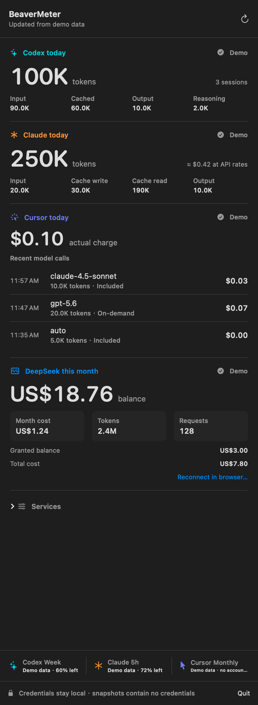

<p align="center">
  
</p>

<h1 align="center">BeaverMeter</h1>

<p align="center">Usage monitoring for Codex, Claude Code, Cursor, and DeepSeek</p>

<p align="center">
  <a href="https://www.apple.com/macos/"></a>
  <a href="https://www.swift.org/"></a>
  <a href="https://github.com/fusheng-ji/token_quota_widget"></a>
  <a href="LICENSE"></a>
</p>

BeaverMeter is a native macOS menu-bar app and WidgetKit extension that keeps
Codex and Claude Code token activity and quota, Cursor model-call costs and
Monthly allowance, and DeepSeek monthly usage and wallet balance in one place.

See [CHANGELOG.md](CHANGELOG.md) for the problem addressed by every verifiable
release.

## Interface

The menu bar shows Codex tokens, Claude tokens (`✳︎`), Cursor's latest actual
charge and DeepSeek's wallet balance in one compact line. The popover expands
this into Codex input, cached input, output and reasoning totals; Claude input,
cache write, cache read and output totals with an API-rate cost estimate;
Cursor's daily actual charge and the latest 20 model calls; and DeepSeek
balance, current-month cost, tokens and requests.

The Widget adapts the four provider panels to every supported family:

Codex's and Claude's allowances stay the primary values; their **Today** lines
show the same daily token totals as the menu. Token freshness is independent
of quota freshness, so a failed remote scan is visible even when the quota API
is healthy. Unknown values show `—`, while a successful empty day shows `0`.

| Family | Layout |
| --- | --- |
| Small | One row per service; with one or two services, larger panels |
| Medium | Services in pairs; an odd service out spans the bottom row |
| Large | Pairs with reset times, progress and DeepSeek details; one or two services stack full width |
| Extra Large | Large layout with wider panels |

### Services

Every layout adapts to the services you actually use. Each service is set to
**Auto** by default and appears once it has produced data on this Mac, so a
missing Cursor install or an unconnected DeepSeek account leaves no empty
panel. Open **Services** at the bottom of the popover to force a service
**On** (for example to connect DeepSeek) or **Off**. Services switched off are
not contacted at all. The switches are stored in
`~/Library/Application Support/BeaverMeter/beaver-meter-settings.json`, which
the Widget and collector read too.

Examples: [three services, Medium](screenshots/widget-medium-three-services.png)
and [two services, Large](screenshots/widget-large-two-services.png).

<table>
  <tr>
    <th colspan="2">Menu-bar popover</th>
  </tr>
  <tr>
    <td colspan="2" align="center">
      
    </td>
  </tr>
  <tr>
    <th>Small Widget</th>
    <th>Medium Widget</th>
  </tr>
  <tr>
    <td align="center">
      
    </td>
    <td align="center">
      
    </td>
  </tr>
  <tr>
    <th>Large Widget</th>
    <th>Extra Large Widget</th>
  </tr>
  <tr>
    <td align="center">
      
    </td>
    <td align="center">
      
    </td>
  </tr>
</table>

Every screenshot is generated from the bundled preview snapshot; none contains
live account values or private Cursor activity.
The [remote-unavailable example](screenshots/widget-small-remote-unavailable.png)
shows how today's cached tokens remain visible with an amber `Remote` warning.

Codex and Cursor show remaining allowance, reset countdown and a progress line.
Codex is teal and Cursor is indigo; values below 50% turn amber and values below
20% turn red. DeepSeek uses blue and reports its real wallet balance and monthly
activity. Because DeepSeek does not publish a quota limit or reset time,
BeaverMeter does not invent a percentage or progress bar.

## Data sources and semantics

### Codex tokens

The bundled collector uses
[CodexBarCore](https://github.com/steipete/CodexBar/) pinned to the 0.56.5 release
commit [`07f2a670229bca1a34bb7eda5284c89657b8df9a`](https://github.com/steipete/CodexBar/commit/07f2a670229bca1a34bb7eda5284c89657b8df9a).
Its local scanner aggregates the current local day across `~/.codex/sessions`,
including compressed sessions, duplicate events, file boundaries and newly
appended events in a still-running Codex task.

An optional SSH source can add Codex tasks running on another machine. The
installer configures the SSH host, remote Codex directory and Python path. The
bundled read-only scanner returns only hashed response/session identifiers,
timestamps and token counts; prompts, responses and credentials never leave
the remote host. Local and remote responses are deduplicated before display.
When SSH is temporarily unavailable, BeaverMeter retains the last remote
reading from the current local day and marks the total stale.
The scanner also checks the current user's running Codex app-server for its
active `CODEX_HOME`. If Codex moves its data, BeaverMeter reads both the
configured directory and the active directory, deduplicates responses and
retains today's discovered records after the process exits. Multiple different
active homes are reported as incomplete rather than silently choosing one.

Both refresh modes resolve the local legacy-format fallback before adding
remote responses that do not occur in the local record set. Active and archived
rollouts are searched regardless of their original date directory. Read failures
remain distinct from a valid empty result, and changing a source configuration
invalidates that source's old totals.

The displayed total is `input + output`. Cached input is part of input and
reasoning is part of output, so neither detail is counted twice.

### Claude tokens

The same CodexBarCore scanner reads Claude Code transcripts from
`$CLAUDE_CONFIG_DIR/projects` when that variable is set, otherwise from
`~/.config/claude/projects`, `~/.claude/projects` and Claude Desktop's local
Claude Code stores. Streamed chunks of one message are counted once by
message and request ID, and the day follows the local time zone. BeaverMeter
keeps its own scan index in
`~/Library/Application Support/BeaverMeter/claude-cost-usage/`.

Claude's `input_tokens` excludes cache traffic, so the displayed total is
`input + cache write + cache read + output`. The cost is an estimate at API
list prices from CodexBarCore's bundled price table; it is hidden for models
the table does not know yet and is not what a Pro or Max subscription is
billed. A machine without Claude transcripts shows no data rather than `0`.

### Cursor call costs and Monthly usage

The collector reads Cursor's existing local sign-in token from `state.vscdb`,
keeps it in process memory and requests the same official Dashboard data used
by [cursor.com/dashboard/usage](https://cursor.com/dashboard/usage):

```text
https://cursor.com/api/dashboard/get-filtered-usage-events
https://cursor.com/api/usage-summary
```

Each call uses `chargedCents`, the amount actually deducted by Cursor, rather
than the model provider list price. `$0.00` calls remain visible. If a valid
call has no valid actual charge, its charge is shown as unknown and the daily
total is withheld instead of understated.

Monthly usage prefers `individualUsage.plan`, then `individualUsage.overall`
when Cursor exposes an individual Enterprise allowance. Team pools and
administrator Team Caps are never presented as personal Monthly usage.

### Codex quota

The quota panel reuses the existing Codex sign-in from `~/.codex/auth.json` and
requests:

```text
https://chatgpt.com/backend-api/wham/usage
```

Windows are identified by `limit_window_seconds`; the window with the least
remaining allowance becomes the Widget summary. Credits-only responses show a
balance, unlimited or exhausted state without inventing a percentage.

### Claude quota

The Claude quota reuses Claude Code's own sign-in and requests the windows
shown by Claude Code's `/usage`:

```text
https://api.anthropic.com/api/oauth/usage
```

The five-hour, weekly and model-scoped weekly (Opus or Sonnet) windows are
compared and the one with the least remaining allowance becomes the Widget
summary. The access token is read from `~/.claude/.credentials.json` (or
`$CLAUDE_CONFIG_DIR/.credentials.json`), otherwise from the login Keychain
item `Claude Code-credentials` through `/usr/bin/security`, which is how
Claude Code writes it. BeaverMeter never refreshes the token, because that
would rotate the refresh token Claude Code depends on; an expired sign-in is
shown as **Sign in** until the `claude` CLI refreshes it. Set
`CLAUDE_KEYCHAIN_ACCESS=0` in `config.env` to skip the Keychain entirely.

### DeepSeek usage and balance

Choose **Connect in browser…** in the menu. BeaverMeter opens the official
DeepSeek Platform page and continues checking in the background, so closing the
popover does not interrupt sign-in.

For Chromium browsers (Chrome, Edge, Arc, Brave and compatible variants), the
collector reads only the `userToken` entry belonging to
`https://platform.deepseek.com`. With Safari, BeaverMeter requests macOS
Automation access to the official DeepSeek tab and reads the same key through
Safari's Apple Events interface. In Safari, first enable **Settings → Advanced
→ Show features for web developers**, then **Settings → Developer → Allow
JavaScript from Apple Events**.

The token is validated against DeepSeek and stored at
`~/Library/Application Support/BeaverMeter/deepseek-platform-token` with mode
`600`. The collector requests the same official data used by
[platform.deepseek.com/usage](https://platform.deepseek.com/usage):

```text
https://platform.deepseek.com/api/v0/users/get_user_summary
https://platform.deepseek.com/api/v0/usage/amount?month=<month>&year=<year>
https://platform.deepseek.com/api/v0/usage/cost?month=<month>&year=<year>
```

The range starts on the first day of the current local month. Token totals add
cache-hit input, cache-miss input and output exactly once. Costs and balances
retain DeepSeek's returned currency. DeepSeek failures do not interrupt Codex
or Cursor refreshes, and the last successful DeepSeek value remains visible as
stale.

## Refresh and fallback

BeaverMeter refreshes on launch, whenever the popover opens, on manual refresh
and every five minutes through its LaunchAgent. The Widget requests a matching
five-minute timeline, subject to WidgetKit scheduling.

While the app is running, Codex and Claude activity refresh every 45 seconds
through the same collector service used by full refreshes. These activity polls do not call
the other providers or the quota APIs. Overlapping app requests are coalesced;
collectors serialize snapshot writes, and the app reloads Widget timelines only
when it adopts a newer snapshot.

Codex tokens, Claude tokens, Cursor costs, Cursor quota, Codex quota, Claude
quota and DeepSeek usage refresh independently. If one source fails, its latest successful value stays visible
as stale while the others continue updating. Cache older than three hours gets
a strong warning; missing live data is never replaced with preview data.

The snapshot is schema v6, which adds the Claude values. A schema v5 snapshot
is read with Claude marked unavailable, so upgrades keep the other providers'
stale fallback. Snapshots from schema v2-v4 are rejected and regenerated by the
next refresh.

## Privacy

- Cursor, Codex and Claude Code credentials come from existing local sessions
  and remain in collector memory. The validated DeepSeek browser token is stored locally with
  mode `600` for background refresh.
- The snapshot contains no authentication tokens, cookies, user/team/conversation IDs, prompts
  or response content.
- HTTP requests use `cursor.com`, `chatgpt.com`, `api.anthropic.com` and
  `platform.deepseek.com`,
  require successful responses, validate response shape and use finite timeouts.
  Optional SSH traffic goes only to the configured host, with non-interactive
  authentication, an eight-second connection timeout and a 30-second total timeout.
- The snapshot is atomically replaced at
  `~/Library/Application Support/BeaverMeter/beaver-meter-snapshot.json`.
- The data directory is mode `700`; credentials and snapshots are mode `600`.
- Repository screenshots use deterministic `UsageSnapshot.preview` data only.

## Requirements and installation

- macOS 14 or newer
- Cursor signed in locally
- Codex desktop app or CLI used locally
- Claude Code used locally (optional; signed in for the quota)
- Full Xcode at `/Applications/Xcode.app`
- [XcodeGen](https://github.com/yonaskolb/XcodeGen)

Install or upgrade:

```bash
brew install xcodegen
chmod +x scripts/*.sh Tests/*.sh
./scripts/install.sh
```

The installer asks for an optional Apple Developer Team ID, a unique bundle
prefix, local data paths, an optional remote source and a refresh interval. It builds
`~/Applications/BeaverMeter.app`, installs the
`io.github.beavermeter.refresh` LaunchAgent, registers the Widget and starts the
menu-bar app.

SSH is disabled by default on a fresh install. When enabling it, specify the
SSH host alias, absolute remote Codex directory and absolute Python executable
path. Upgrades retain the existing values, including a disabled source. These
settings are stored in the private `config.env` as `CODEX_REMOTE_SSH_HOST`,
`CODEX_REMOTE_ROOT` and `CODEX_REMOTE_PYTHON`.

Claude needs no installer questions. To use a non-default Claude Code
directory, add `CLAUDE_CONFIG_DIR=/path` to `config.env`; upgrades keep it and
`CLAUDE_KEYCHAIN_ACCESS`.

Building completes before the installer stops the running app or agent. During
replacement it keeps a rollback copy of the app, agent and data; validation
failure restores them before restarting the old installation. Widget repair
uses the same registration and process helpers.

### Upgrading from 4.4.0

The 5.0.0 installer migrates `config.env`, the DeepSeek token and a valid schema
v5 snapshot from `~/Library/Application Support/CodexWeek/` into the new
BeaverMeter data directory. Existing destination files always win. It keeps a
rollback copy while validating the replacement; after a successful install it
removes the old app, LaunchAgent, data and logs. If validation fails, the old
installation is restored and the legacy data remains available.

The App and Widget now have new bundle IDs and the Widget kind changed. macOS
cannot convert an existing desktop Widget automatically: remove the old Widget,
then add **BeaverMeter** from **Edit Widgets**.

The new build settings and script overrides are `BEAVERMETER_*` and
`BEAVER_METER_CONFIG`. Version 5.0.0 also accepts the legacy `CODEXWEEK_*` and
`CODEX_WEEK_CONFIG` names as lower-priority aliases.

## Development and tests

Run the complete local test suite:

```bash
./scripts/test.sh
```

Generate the project and run Swift tests:

```bash
xcodegen generate
xcodebuild \
  -project BeaverMeter.xcodeproj \
  -scheme BeaverMeter \
  -derivedDataPath /tmp/beavermeter-derived \
  test
```

Run the network-free integration and migration tests:

```bash
./Tests/collector_test.sh \
  /tmp/beavermeter-derived/Build/Products/Debug/BeaverMeterCollector
./Tests/migration_test.sh
```

The `BeaverMeterPreviewRenderer` target regenerates README screenshots from
fixed demo snapshots, including failure and long-value cases. Preview stores do
not read the production snapshot, import sessions or launch a collector.

Collector fixture overrides:

```text
CODEX_TOKEN_FIXTURE
CODEX_USAGE_FIXTURE
CLAUDE_TOKEN_FIXTURE
CLAUDE_USAGE_FIXTURE
CURSOR_EVENTS_FIXTURE
CURSOR_SUMMARY_FIXTURE
DEEPSEEK_USAGE_FIXTURE
DEEPSEEK_SUMMARY_FIXTURE
CURSOR_STATE_DB
CODEX_TOKEN_CACHE_ROOT
CLAUDE_TOKEN_CACHE_ROOT
CLAUDE_CONFIG_DIR
CODEX_REMOTE_RESPONSE_FIXTURE
```

Coverage includes schema v6 round trips and v5 upgrades, status presentation, refresh request
coalescing, private atomic writes, subprocess timeout and large stdio, mixed
Codex formats and cross-host deduplication, rollover and partial records,
unreadable sources, remote failure/recovery, Codex and Claude quota-window
selection, Claude transcript deduplication, tolerant
Cursor number decoding, actual-charge totals, independent stale fallback,
migration/configuration preservation and installer rollback. Tests use isolated
fixtures and fake SSH/system commands rather than real account sessions.

## Troubleshooting

- **Cursor says Sign in:** open Cursor, confirm the intended account is active,
  then refresh.
- **Codex has no token data:** run at least one local Codex session and refresh.
- **Claude has no token data:** run Claude Code once, or set `CLAUDE_CONFIG_DIR`
  in `config.env` if it uses a non-default directory.
- **Claude quota says Sign in:** Claude Code's saved token has expired. Run the
  `claude` CLI once (or `/login` inside it) so it refreshes the token, then
  refresh BeaverMeter.
- **Remote Codex is missing:** verify that the configured SSH alias works in a
  non-interactive terminal and that the remote Codex and Python paths still exist.
  If Codex has moved its home, update `CODEX_REMOTE_ROOT` to the new path; active
  app-server discovery keeps today's records visible during the move.
- **DeepSeek says Connect:** choose **Connect in browser…** and finish signing in
  on the official page. Safari may request Automation permission; enable both
  developer settings described above, then use **Check now**.
- **Data is stale:** inspect `~/Library/Logs/BeaverMeter/` and verify access to
  `cursor.com`, `chatgpt.com`, `api.anthropic.com` and `platform.deepseek.com`.
- **Widget is blank, stale, missing or duplicated:** run
  `./scripts/repair_widget.sh`. The script removes conflicting registrations,
  restarts the WidgetKit caches and relaunches BeaverMeter. Add the Widget again
  from **Edit Widgets** only when upgrading from 4.4.0.

## Project structure

- `App/` — app entry, state and menu popover
- `Collector/` — Codex, Claude, Cursor and DeepSeek clients and snapshot writer
- `Widget/` — timeline provider, adaptive panels and previews
- `Shared/` — schema v6 models, loading and formatters
- `Tests/` — Swift tests, migration test and network-free fixtures
- `PreviewRenderer/` — deterministic screenshot generator
- `Design/Logo/` — BeaverMeter logo master
- `scripts/` — install, refresh, migration, Widget repair and uninstall helpers

## License

BeaverMeter is released under the MIT License. CodexBarCore and adapted
CodexBar code are used under CodexBar's MIT License; see
[THIRD_PARTY_NOTICES.md](THIRD_PARTY_NOTICES.md).
